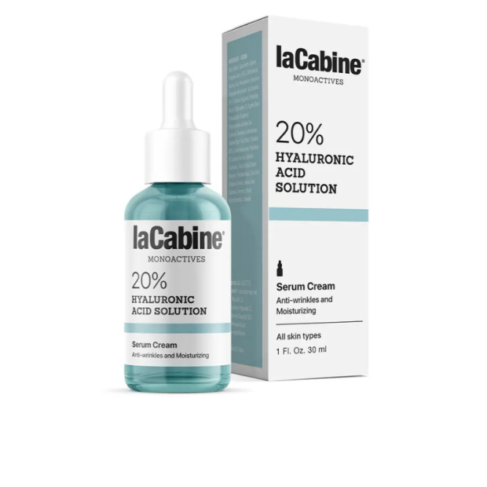

# 03 Concentration d’un actif : 📝 Fiche élève

**Concentration massique – Quantité de matière**

> En BTS MECP, un calcul n’est jamais suffisant seul :  
> il doit être **expliqué, justifié et interprété** dans un contexte professionnel.

---

### 🎯 Objectifs de la séance
- Comprendre ce que signifie la **concentration d’un actif cosmétique**
- Définir et calculer une **concentration massique**
- Introduire la notion de **quantité de matière**
- Interpréter un résultat dans un contexte cosmétique

---

## 🧴 Situation professionnelle

Vous travaillez dans un laboratoire cosmétique.

Un sérum anti-âge est commercialisé avec l’indication suivante :

> **« 20 % d’acide hyaluronique »**

Avant toute validation de formulation ou de communication produit,
il est nécessaire de **traduire cette information commerciale
en données scientifiques exploitables**.

---

## 🧴 Produit cosmétique support

*Sérum cosmétique affichant une teneur de 20 % en acide hyaluronique.*

⚠️ Cette indication est couramment utilisée en cosmétique,  
mais elle doit être **interprétée scientifiquement**.

---

## 🧠 Travail 1 – Analyse qualitative (sans calcul)

1. Que signifie, selon vous, l’indication **« 20 % »** ?  

   ..............................................................................
   ..............................................................................

2. S’agit-il d’une information :
   ☐ qualitative  ☐ quantitative  

3. Cette indication permet-elle de connaître précisément la quantité d’actif
contenue dans le produit ?  
   ☐ Oui  ☐ Non  

Justifiez brièvement votre réponse.

..............................................................................
..............................................................................

---

## 🔍 Travail 2 – Identifier les grandeurs utiles

Pour exprimer scientifiquement la quantité d’un actif dans un produit,
il est nécessaire de connaître certaines grandeurs.

1. Quelle grandeur permet de quantifier un actif ?  
   ☐ masse  ☐ volume  ☐ température  

2. Quelle grandeur permet de décrire la solution dans laquelle l’actif est dissous ?  
   ☐ masse  ☐ volume  ☐ pression  

3. Complétez la phrase suivante :

> Pour décrire quantitativement un actif dans un produit cosmétique,
> il faut relier la **..................** de l’actif au **..................** de la solution.

---

## 🧪 Travail 3 – Concentration massique

On appelle **concentration massique** la masse de soluté dissoute
dans un volume de solution.

La relation est :

\[
C_m = \frac{m}{V}
\]

avec :
- \( C_m \) : concentration massique (g·L⁻¹)
- \( m \) : masse du soluté (g)
- \( V \) : volume de solution (L)

---

### Application guidée

Un sérum contient **5,0 g d’acide hyaluronique**
dissous dans **250 mL** de solution.

1. Identifier le **soluté** :  
   ..............................................................................

2. Identifier la **masse du soluté** :  
   ..............................................................................

3. Identifier le **volume de la solution** :  
   ..............................................................................

4. Convertir le volume en litres :  
   ..............................................................................

5. Calculer la **concentration massique** :  

   ..............................................................................

6. Donner l’unité du résultat :  
   ..............................................................................

---

## ✍️ Travail 4 – Interprétation (attendus BTS)

Rédigez une phrase d’interprétation complète.

..............................................................................
..............................................................................

*Aide : commencez par « La concentration massique de l’actif est de… »*

---

## 🧠 Travail 5 – Introduction de la quantité de matière

En chimie, on utilise également la **quantité de matière**, notée \( n \),
exprimée en **moles (mol)**.

La relation est :

\[
n = \frac{m}{M}
\]

où :
- \( m \) est la masse (g),
- \( M \) est la masse molaire (g·mol⁻¹).

👉 Cette notion sera approfondie dans les prochaines séances.

---

## 🧾 Trace écrite

### Définitions

Pour vous, comment définiriez-vous :

- **Concentration massique** :  
  ..............................................................................

- **Quantité de matière** :  
  ..............................................................................

---

## 🔗 Pour la suite…

Lors de la prochaine séance, nous apprendrons à **comparer des concentrations**
et à **vérifier la conformité d’un dosage cosmétique**.
