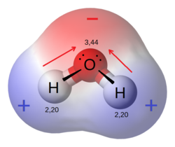
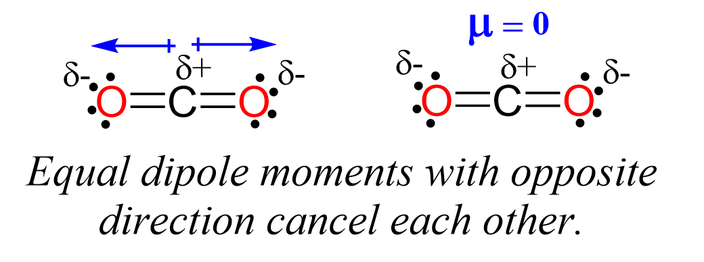
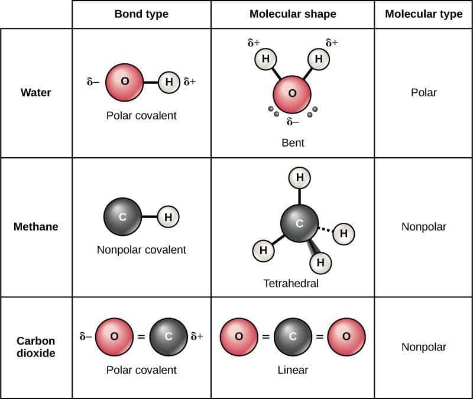
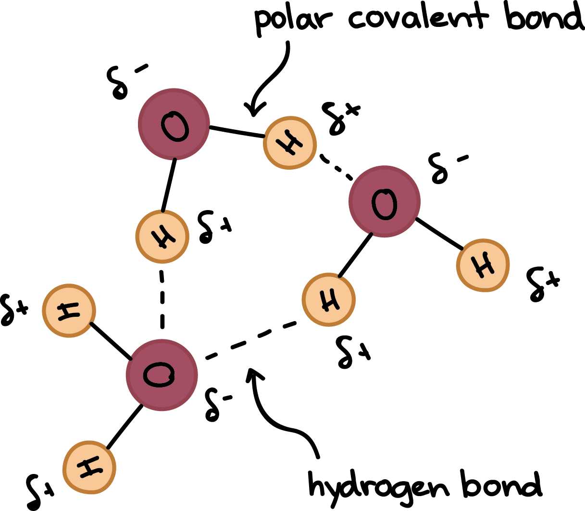
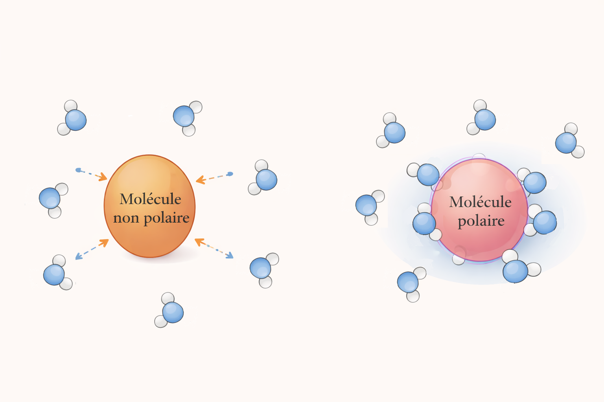

# 14 – Interactions et compatibilités 🧴🧪  
**Polarité – Liaisons H – Interactions intermoléculaires – Solubilité / miscibilité – Décision de formulation (E2)**

> En E2, on te demande d’expliquer **pourquoi** un mélange est homogène ou non, et de proposer une **décision professionnelle** (formulation / contrôle qualité / ordre d’introduction).

---

## 🎯 Objectifs de la séance

- Relier une structure microscopique à la **polarité** (δ+ / δ−)
- Identifier les **interactions** entre molécules :

  - dispersion (London),
  - dipôle–dipôle,
  - **liaison hydrogène**
  - (ion–dipôle pour expliquer dissolution des sels)

- Expliquer qualitativement :

  - **solubilité** (soluté dans un solvant),
  - **miscibilité** (deux liquides entre eux),
  - **compatibilité** (risque de déphasage / trouble / précipité)

- Argumenter une recommandation type **E2**

---

## 🧴 Situation professionnelle (E2)

Vous êtes en laboratoire cosmétique.  
Une formule de lotion aqueuse doit intégrer :

- un ingrédient A **hydrophile** (facile dans l’eau),
- un ingrédient B **lipophile** (parfum / huile essentielle / actif lipophile).

Le responsable vous demande :

1) d’expliquer scientifiquement **la compatibilité** (ou non) des mélanges,  
2) de proposer une **solution technique** (choix du milieu / solubilisation / ordre d’introduction),  
3) en justifiant vos réponses avec des **indices microscopiques**.

---

# 🧠 Travail 1 – Polarité : δ+ / δ− et molécules polaires

### Document 1 – Polarité de l’eau

{ width="50%" .center }

1\. Sur le schéma :
- quel atome porte **δ−** ? __________  
- quel(s) atome(s) porte(nt) **δ+** ? __________  

2\. En 2–3 lignes : pourquoi la liaison O–H est-elle **polarisée** ?  
(Indice : attraction des électrons)  
    

---

### Document 2 – Un dipôle dans la molécule d’eau

{ width="50%" .center }

3\. La molécule d’eau est-elle globalement **polaire** ? ☐ oui ☐ non  
Justifier en 2 lignes max (mot attendu : dipôle / répartition des charges).  
   

---

# 🧩 Travail 2 – Liaisons polaires ≠ molécule polaire (nuance E2)

### Document 3 – Exemple CO₂ : liaisons mais pas de dipôle global

{ width="80%" .center }

4\. La molécule de CO₂ est-elle globalement **polaire** ? ☐ oui ☐ non  
Justifier en 2–3 lignes :  
- que se passe-t-il avec les dipôles des deux liaisons C=O ?  
    

### Document 4 – Comparaison (repère)

{ width="90%" .center }

5\. Compléter (sans calculs) :

| Molécule | Polaire / non polaire | Justification courte |
|---|---|---|
| H₂O | | |
| CH₄ | | |
| CO₂ | | |

    

---

# 🧲 Travail 3 – Interactions intermoléculaires : ce qui explique “compatibilité”

### Document 5 – Dispersion (London) : présent partout

{ width="50%" .center }

6\. Compléter :
- Les interactions de dispersion (London) existent : ☐ seulement dans l’eau ☐ dans toutes les molécules  
- Elles sont dominantes surtout dans les milieux : ☐ polaires ☐ apolaires  
   

---

### Document 6 – Liaison hydrogène (liaison H)

{ width="50%" .center }

7\. Donner la condition principale pour qu’une **liaison hydrogène** soit possible :  
(Indice : H lié à …)  
   

8\. Citer 2 conséquences possibles de la présence de liaisons H en cosmétique (au choix) :  
(ex : solubilité dans l’eau, viscosité, stabilité, comportement d’actifs…)  

- Conséquence 1 : ____________________________  
- Conséquence 2 : ____________________________  
   

---

### Document 7 – Interactions entre molécules d’eau (mise en évidence)

{ width="70%" .center }

9\. À partir du document : expliquer en 3–4 lignes pourquoi l’eau “accroche” bien certaines molécules (hydrophiles).  
(Mots attendus : polarité / δ+ δ− / liaison H)  
     

---

# 🧂 Travail 4 – Pourquoi un sel se dissout dans l’eau ? (ion–dipôle)

### Document 8 – Hydratation d’ions (ex : Na⁺ et Cl⁻)

{ width="70%" .center }

10\. Compléter :

- l’eau entoure les ions car elle est : ☐ polaire ☐ apolaire  
- l’interaction en jeu est de type : ☐ ion–dipôle ☐ London ☐ “aucune interaction”  
   

11\. En 3–4 lignes : expliquer qualitativement pourquoi un sel peut se dissoudre dans l’eau.  
(Mots attendus : ion / dipôle / orientation des molécules d’eau / stabilisation)  
     

---

# 🧴 Travail 5 – Compatibilité eau / huile : expliquer un déphasage

### Document 9 – Eau + molécule polaire / eau + molécule apolaire

{ width="80%" .center }

12\. À partir de ce document : expliquer en 4–6 lignes pourquoi une phase huileuse (apolaire) est généralement **non miscible** avec l’eau.  
(Mots attendus : interactions / “semblable dissout semblable” justifié / liaisons H / London)  
      

---

# 🧪 Travail 6 – Mini dossier E2 : décider et justifier

### Document 10 – Extrait CQ / Formulation

> « La formule est une lotion aqueuse.  
> On veut intégrer un parfum (lipophile).  
> Observation : ajout direct du parfum → trouble / gouttelettes visibles / séparation.  
> Objectif : obtenir une solution homogène ou une dispersion stable. »

13\. **Interpréter** : Pourquoi l’ajout direct du parfum pose problème ? (3–4 lignes)  
     

14\. **Décider** : proposer **2 solutions professionnelles** possibles (au choix) et les justifier scientifiquement :  
📌 Attendu E2 : citer au moins **1 interaction** dans la justification.

- Solution 1 (technique) : _________________________________  
  Justification scientifique (2–3 lignes) :  
      

- Solution 2 (technique) : _________________________________  
  Justification scientifique (2–3 lignes) :  
      

---

## ✍️ Conclusion (format E2 – 6 lignes max)

Avec tes mots, explique comment on passe de :
**polarité → interactions → miscibilité/solubilité → décision de formulation**.

**Mots obligatoires** :  
**polaire – apolaire – liaison H – London – compatibilité – décision**

     

---

## 🔧 Outils méthodologiques associés
➡️ Voir : [*Fiche méthode 05 – Lire une représentation microscopique dans un dossier scientifique (E2)*](https://bts-mecp-physique-chimie-688080.forge.apps.education.fr/Methodologie/05_fiche_methode/)

➡️ Voir : [*Fiche méthode 01 – Justifier une réponse en physique-chimie*](https://bts-mecp-physique-chimie-688080.forge.apps.education.fr/Methodologie/01_fiche_methode/)

---

