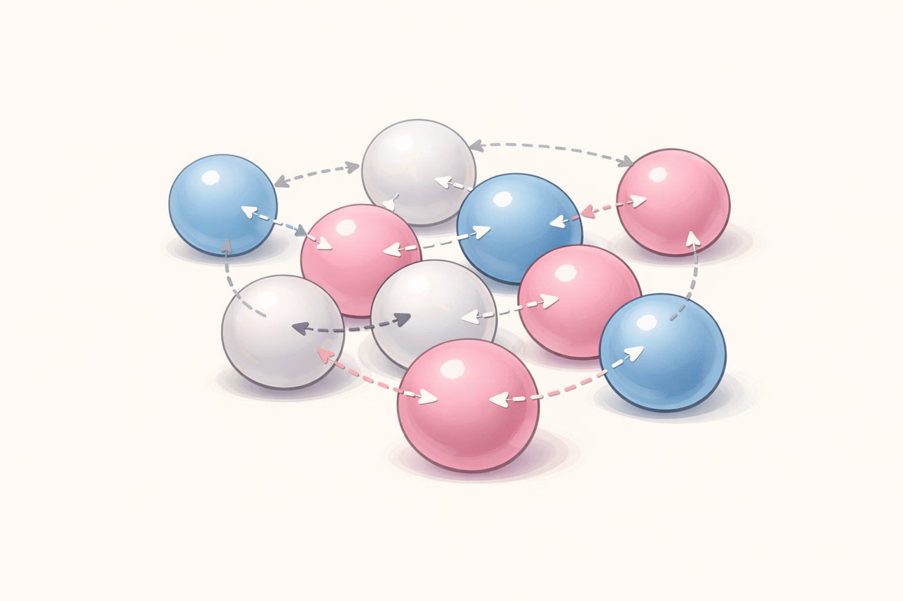
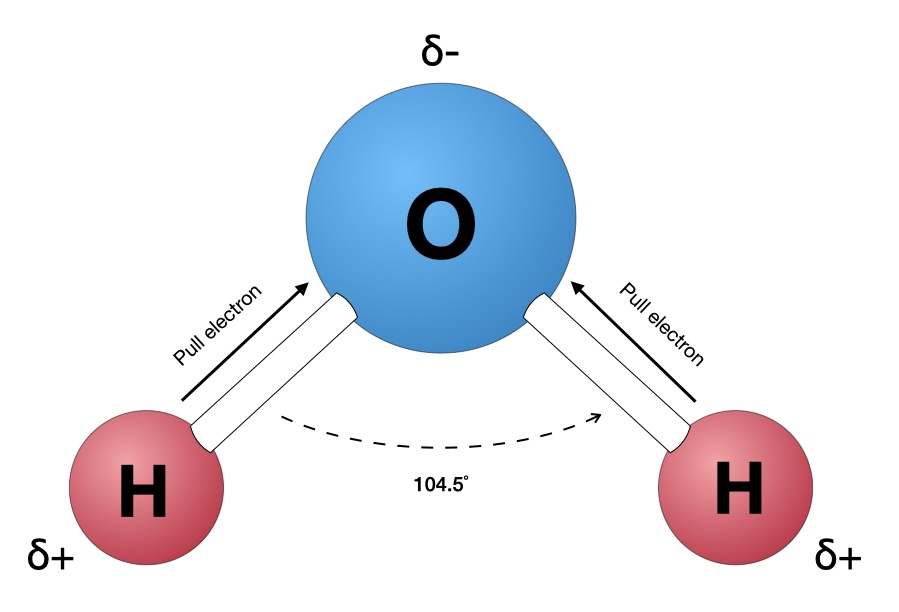
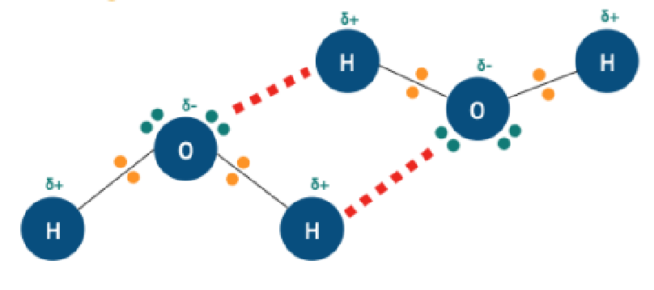
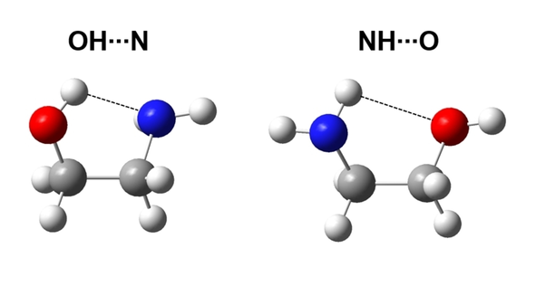

# 14 – Interactions moléculaires et propriétés des produits cosmétiques  
## 🖊️ Évaluation formative (logique E2)

**Comprendre – Lire – Interpréter – Argumenter un choix de formulation**

⏱️ Durée : 25–30 minutes  
🎯 Objectif : vérifier la capacité à **comprendre les interactions moléculaires**, **interpréter leur rôle sur les propriétés d’un produit cosmétique**, et **argumenter scientifiquement**, conformément aux attendus de l’épreuve  
**E2 – Expertise scientifique et technologique**.  

📌 Évaluation formative – barème indicatif

---

## 🧴 Contexte scientifique (type E2)

Un laboratoire cosmétique étudie le comportement d’un **actif intégré dans une phase aqueuse**.

Le dossier scientifique indique que la **solubilité**, la **texture** et la **stabilité physique** du produit sont liées aux **interactions moléculaires** entre les différentes espèces chimiques présentes.

Aucune manipulation expérimentale n’est réalisée.  
Les documents nécessaires à l’analyse sont **fournis**.

---

## 📄 Document 1 – Notion d’interaction moléculaire

Les molécules d’un produit cosmétique exercent entre elles des **forces d’attraction**, appelées **interactions moléculaires**.

Ces interactions sont généralement **faibles individuellement**, mais leur effet global influence fortement les propriétés du produit.

   
  <em>Interactions entre molécules</em> 

---

## 📄 Document 2 – Répartition des charges dans une molécule polaire

Une représentation microscopique d’une molécule polaire est fournie.

Elle met en évidence une **répartition inégale des charges électriques**, susceptible d’influencer les interactions entre molécules.

   
  <em>Répartition des charge dans une molécules polaires</em> 

---

## 📄 Document 3 – Exemple de liaison hydrogène entre molécules

Un schéma montre une interaction particulière entre deux molécules contenant des groupes –OH ou –NH.

Cette interaction joue un rôle important dans la **cohésion des phases aqueuses** et la **solubilité** de nombreux actifs cosmétiques.

   
  <em>Exemple de liaison hydrogène entre molécules</em> 
 
  <em>Interaction entre un ion et l’eau</em> 
   
  <em>liaison hydrogène dans une même molécule</em> 

---

## 📄 Document 4 – Extrait de dossier scientifique

> *« L’actif présente une bonne affinité avec la phase aqueuse grâce aux interactions moléculaires qu’il établit avec les molécules d’eau. »*

---

## Exercice 1 – Comprendre les interactions moléculaires (6 points)

1\. Reformuler, avec vos mots, ce que l’on appelle une **interaction moléculaire** à partir du document 1.  
      

2\. Expliquer pourquoi les interactions moléculaires sont importantes pour comprendre le **comportement global** d’un produit cosmétique.  
      

🔎 *Compétences évaluées : comprendre – relier à une situation professionnelle*

---

## Exercice 2 – Polarité et interactions avec l’eau (6 points)

3\. À partir du document 2, expliquer ce que signifie qu’une molécule est **polaire**.  
      

4\. En quoi la polarité d’une molécule influence-t-elle ses **interactions avec l’eau** ?  
      

🔎 *Compétences évaluées : lire un document scientifique – interpréter*

---

## Exercice 3 – Liaison hydrogène et propriétés cosmétiques (8 points)

5\. Identifier, à partir du document 3, les éléments nécessaires à la formation d’une **liaison hydrogène**.  
      

6\. Expliquer pourquoi la liaison hydrogène joue un rôle important dans :
- la **solubilité** d’un actif,
- la **cohésion** d’une phase aqueuse,
- la **texture** d’un produit cosmétique.  
       

🔎 *Compétences évaluées : analyser – relier microscopique et macroscopique*

---

## Exercice 4 – Argumentation scientifique (attendus E2) (8 points)

Un technicien affirme :

> *« Les interactions moléculaires sont faibles, donc elles ont peu d’influence sur les propriétés d’un produit cosmétique. »*

7\. Cette affirmation est-elle scientifiquement acceptable en BTS MECP ?  
☐ Oui  ☐ Non  

Justifier votre réponse (4 à 5 lignes) en vous appuyant sur les notions  
d’**interactions moléculaires**, de **polarité** et de **formulation cosmétique**.

        

🔎 *Compétences évaluées : analyser – argumenter – communiquer*

---

## 🧠 Auto-évaluation (métacognition)

☐ Je comprends ce que sont les interactions moléculaires  
☐ Je comprends le rôle de la polarité dans les interactions  
☐ Je comprends l’importance de la liaison hydrogène en cosmétologie  
☐ Je me sens capable d’argumenter un choix scientifique en E2
